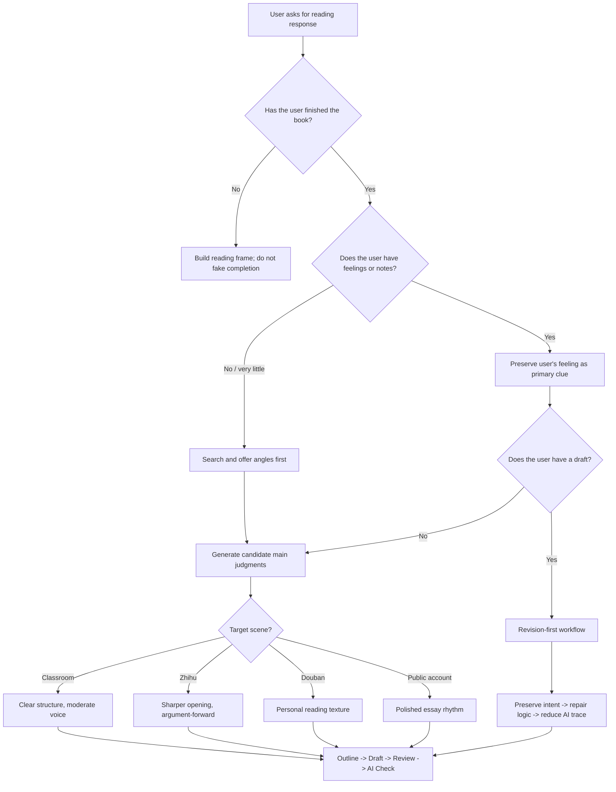

# Decision Tree

Use this file when the user request is unclear, incomplete, or not a standard “write a full reading response” task.

## Main Routing



## Common Cases

### User Has Not Finished The Book

Do:

- build a character and conflict map;
- list questions to watch while reading;
- suggest possible angles after finishing.

Do not:

- write “读完整本书后我觉得”;
- invent personal reading reactions.

### User Has Only One Feeling

One feeling is enough. Treat it as a seed.

```text
我最难受的是福贵最后只剩老牛。
```

Turn it into:

```text
Main judgment: 《活着》不是把苦难写成伟大，而是写人被磨空以后仍然还在活着。
```

### User Already Has A Draft

Start with editing, not rewriting.

| Step | Action |
|---|---|
| 1 | Identify the user's main intent |
| 2 | Mark AI cliches and empty claims |
| 3 | Repair logic and evidence |
| 4 | Preserve voice |
| 5 | Produce a revised version |

### User Wants “降 AI”

Look beyond phrases:

- sentence rhythm;
- paragraph shape;
- plot-to-judgment connection;
- generic ending;
- missing reading process.

### User Needs Classroom Submission

Keep it clear. Do not over-style.

Good classroom reading responses usually have:

- one main judgment;
- a few concrete details;
- moderate personal voice;
- no internet slang;
- no empty moral ending.

