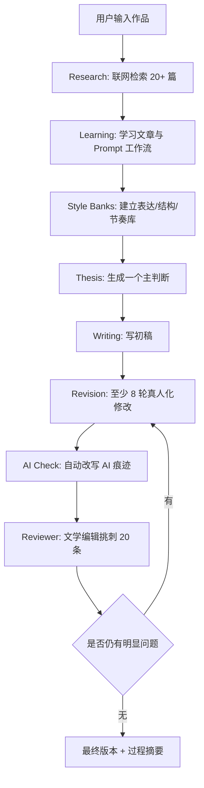

# Classic Literary Review Agent

一个面向中文名著读后感与文学长评的 Agentic Writing Skill。

它不是提示词合集，也不是“把文章写得不像 AI”的修辞补丁。它把一次写作拆成五个可检查阶段：

> Research -> Learning -> Writing -> Revision -> Review

用户输入一本名著后，Agent 必须先联网检索，阅读优秀评论，学习写法和结构，建立当次风格库，再形成自己的主判断，最后经过多轮改写和文学编辑式审稿，输出一篇原创读后感或文学长评。

> [!NOTE]
> 这个 Skill 不是用来“一键代写读后感”的。它更适合帮助用户把真实阅读感受整理成文章：先查资料，避开套话，提炼主判断，搭结构，写初稿，多轮修改，降低 AI 痕迹，最后把文章改得更像一个认真读完一本书的人写出来的。

它真正适合做的是：

1. 帮用户联网查找高质量读后感和文学评论。
2. 帮用户避开常见套话和俗套观点。
3. 帮用户从阅读感受中提炼一个主判断。
4. 帮用户搭文章结构。
5. 帮用户写初稿。
6. 帮用户多轮修改。
7. 帮用户降低 AI 痕迹。
8. 帮用户把文章改得更像“认真读完一本书的人写出来的”。

## 设计理念

| 原则 | 含义 | 反面做法 |
|---|---|---|
| 先研究，再写作 | 写作前必须联网检索并形成 Research Summary | 直接凭印象生成读后感 |
| 学习写法，不复制内容 | 学行文节奏、段落组织、转场技巧、观点推进 | 摘抄、拼接、改写他人句子 |
| 一个中心观点 | 文章围绕最刺痛、最矛盾、最容易被忽略的问题展开 | 主题、人物、情节、意义并列罗列 |
| 多轮修改 | 至少八轮真人化修改，再进入 Reviewer 审稿 | 一稿输出后只做润色 |
| 自动去 AI 痕迹 | 检测到套话、空洞评价、节奏机械时直接改写 | 只提示用户“这里像 AI” |

## 工作流程



## 目录说明

| 路径 | 作用 |
|---|---|
| [SKILL.md](SKILL.md) | Codex Skill 入口，规定何时触发、必须加载哪些模块 |
| [SYSTEM.md](SYSTEM.md) | Agent 身份、硬性规则、输出契约 |
| [WORKFLOW.md](WORKFLOW.md) | 五阶段总流程与门禁 |
| [USAGE.md](USAGE.md) | 普通用户怎么拿它一步步写读后感 |
| [SEARCH.md](SEARCH.md) | 联网检索策略、来源优先级、Research Summary 格式 |
| [GITHUB_PROMPT_LEARNING.md](GITHUB_PROMPT_LEARNING.md) | GitHub Prompt 学习协议 |
| [STYLE_LEARNING.md](STYLE_LEARNING.md) | 从优秀文章中建立各类 Bank |
| [WRITING.md](WRITING.md) | 主判断生成与原创写作规则 |
| [REVISION.md](REVISION.md) | 改稿流程与版本管理 |
| [HUMANIZATION.md](HUMANIZATION.md) | 八轮真人化修改系统 |
| [AI_CHECK.md](AI_CHECK.md) | AI 痕迹检测与自动改写规则 |
| [REVIEWER.md](REVIEWER.md) | 文学杂志编辑式 Reviewer Agent |
| [QUALITY_CHECK.md](QUALITY_CHECK.md) | 最终自检清单 |
| [examples/](examples/) | 作品级完整样例 |
| [examples/readme_usage_examples.md](examples/readme_usage_examples.md) | 面向用户的完整使用流程示例 |
| [docs/](docs/) | 输出契约、联网伦理、离线模式、维护指南 |
| [assets/](assets/) | 可复用模板 |

## 如何用这个 Skill 写一篇读后感

### 推荐使用方式

不要直接输入：

```text
帮我写一篇《悲惨世界》读后感。
```

更推荐输入：

```text
我想写《悲惨世界》的读后感，字数 1500 字，风格要像一个认真读完半年的人写的，不要 AI 腔。请先联网搜索相关评论，提炼 3 个可写角度，再帮我选一个最有力量的观点，最后写成完整读后感。
```

第二种更好，因为它给出了：

| 信息 | 为什么有用 |
|---|---|
| 作品 | Agent 知道要围绕哪本书搜索和写作 |
| 字数 | 文章结构和材料密度更容易控制 |
| 风格 | 能避免默认生成作文腔或论文腔 |
| 先搜索 | 不会直接凭印象写模板文 |
| 先提炼角度 | 能先找到主判断，再写文章 |
| 最后才写文章 | 更容易写出具体、有判断、有阅读痕迹的内容 |

## 分步使用法

### 第一步：先搜索，不要急着写

```text
帮我搜索《悲惨世界》的高质量读后感和文学评论，优先参考知乎、豆瓣、微信公众号和文学评论网站。请提炼常见观点、优秀写法和应该避开的俗套角度。
```

### 第二步：找主判断

```text
根据上一步资料，帮我从《悲惨世界》中找 5 个适合大学生写读后感的主判断。要求不要太像教材答案，也不要太像 AI 总结。
```

### 第三步：选一个最有力量的观点

```text
请从这 5 个主判断里，选一个最适合写成 1500 字读后感的角度，并说明为什么它比其他角度更好。
```

### 第四步：搭文章结构

```text
围绕这个主判断，帮我搭一篇 1500 字读后感的结构。要求剧情概括不超过全文 20%，重点放在阅读感受、人物理解和思想推进。
```

### 第五步：写初稿

```text
按照这个结构写一篇完整初稿。语言要自然，有个人阅读痕迹，不要用“体现了、揭示了、发人深省、升华主题”这些 AI 腔词。
```

### 第六步：降低 AI 味

```text
帮我把这篇读后感降 AI 味。请删除套话，打散过于整齐的句式，增加真实阅读过程中的犹豫、停顿和重新理解。
```

### 第七步：最终润色

```text
最后帮我检查这篇文章是否像真人写的。重点检查：是否空泛、是否套话、是否像读书报告、是否有真正的阅读感受。
```

## 推荐输入模板

```text
作品名称：
读完程度：
字数要求：
提交场景：
希望风格：
已有感受：
必须提到的人物/情节：
不想写的角度：
是否允许联网搜索：
是否需要降低 AI 味：
```

输入越具体，生成结果越不像模板文。尤其是“已有感受”和“不想写的角度”，能帮 Agent 保留用户自己的阅读痕迹。

## 不推荐用法

不推荐：

```text
帮我写《活着》读后感。
```

原因：

- 信息太少。
- 容易生成模板文。
- 容易出现剧情概括。
- 容易写成“苦难、人性、生命意义”这类空泛内容。
- 很难体现真实阅读体验。

更推荐：

```text
我读完《活着》后最难受的是福贵最后只剩下老牛作伴。请围绕“苦难不是把人变伟大，而是把人一点点磨空”这个角度，帮我写一篇 1000 字读后感。要求不要写成励志文，不要使用 AI 腔词。
```

## 基础使用方式

### 最小输入

```text
用 Classic Literary Review Agent 写《悲惨世界》读后感，2000 字，中文长文平台风格。
```

### 推荐输入

```text
作品：《百年孤独》
篇幅：2500-3000 字
读者：高中到大学阶段的普通读者
要求：不要剧情复述，重点写“孤独为什么是循环而不是性格”
必须联网：是
输出：Research Summary、Style Banks 摘要、初稿、修改记录、最终稿
```

### Agent 必须输出

1. Research Summary
2. Prompt Design Summary
3. Style Learning Summary
4. Main Thesis
5. Draft
6. Revision Log
7. AI Check Report
8. Reviewer Report
9. Final Essay

更多实际场景见 [USAGE.md](USAGE.md) 和 [examples/readme_usage_examples.md](examples/readme_usage_examples.md)。

## 联网模式

> [!IMPORTANT]
> 只要运行环境支持联网，Agent 必须先联网，再写作。

联网模式下，Agent 至少阅读 20 篇相关材料，并优先检索知乎高赞回答、豆瓣长评、微信公众号文学评论、B 站读书 UP 主文字稿、中国知网公开摘要、文学网站评论、国外 Literary Review、Medium、Reddit Books、GitHub Prompt Repository。

## 离线模式

离线模式只能在用户明确允许时启用。Agent 必须说明：

- 当前无法联网。
- 输出基于模型已有知识和用户提供材料。
- 不能声称已经检索或阅读外部文章。
- 必须降低结论确定性。

详见 [docs/offline_mode.md](docs/offline_mode.md)。

## 适用模型

| 能力 | 建议 |
|---|---|
| 联网检索 | 必须支持搜索、打开网页、记录来源 |
| 长上下文 | 建议支持长文档阅读与跨文档综合 |
| 多轮写作 | 必须能保留草稿、修改记录和 Reviewer 意见 |
| 中文风格控制 | 必须能识别 AI 套话、作文腔、教材式分析 |

## Roadmap

- [x] v2.0: Agentic 五阶段重构
- [x] 联网检索协议
- [x] GitHub Prompt 学习模块
- [x] Style Banks 系统
- [x] Humanization 八轮改稿
- [x] Reviewer Agent
- [ ] v2.1: 加入可执行脚本，辅助生成 Research Summary 模板
- [ ] v2.2: 加入示例评测集与评分表
- [ ] v3.0: 支持本地资料库、浏览器自动化与引用管理

## 贡献指南

欢迎提交：

- 新作品 example。
- 更严格的 AI 痕迹规则。
- 更好的 Research Summary 模板。
- 真实写作案例的 Revision Log。
- 对搜索来源优先级的改进。

贡献时请遵守 [docs/research_ethics.md](docs/research_ethics.md)：不得复制外部文章，不得用改写掩盖抄袭，不得伪造联网研究。
