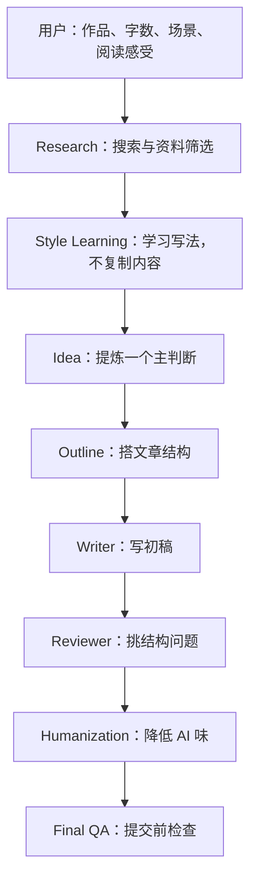

# Classic Literary Review Skill

中文读后感与文学长评的写作系统。不追求"一句话生成文章"，而是把写作拆成研究、
 风格学习、主判断、结构、初稿、审稿、改稿和提交前检查，
让文章保留真实的阅读痕迹。

---

## 目录

- [这个项目是什么](#这个项目是什么)
- [能做什么 / 不做什么](#能做什么--不做什么)
- [快速开始](#快速开始)
- [工作流程](#工作流程)
- [最佳实践](#最佳实践)
- [项目结构](#项目结构)
- [示例](#示例)
- [常见问题](#常见问题)
- [路线图](#路线图)
- [参与贡献](#参与贡献)
- [许可证](#许可证)

---

## 这个项目是什么

这是一个 **Markdown-first 的 Skill 仓库**——不是一个 App，不依赖构建步骤，
也不绑定特定工具。 你可以把它当成一套写作方法论，用在任何支持读取 Markdown 文件
的 AI Agent 工具里。

它的核心假设是：**好的读后感不是"生成"出来的，而是经过研究、判断、
结构和多轮修改之后整理出来的。**

## 能做什么 / 不做什么

| 能做什么 | 不做什么 |
|---|---|
| 从真实阅读感受中提炼主判断 | 代写没有阅读痕迹的万能作文 |
| 联网整理高质量评论与常见角度 | 复制、拼接或改写外部评论 |
| 学习文章结构、节奏和转场方法 | 模仿单一作者的句子 |
| 搭结构、写初稿、审稿、改稿 | 用剧情复述填满篇幅 |
| 检查 AI 腔、套话和万能结尾 | 伪造用户没有经历过的阅读感受 |

## 快速开始

### 安装

```bash
git clone https://github.com/lyingdowndragon6839-design/Classic-Literary-Review-Skill.git
cd Classic-Literary-Review-Skill
```

如果你的工具链要求指定入口文件，请使用 [skill.md](skill.md)。

### 不要这样输入

```text
帮我写《活着》读后感。
```

信息太少，容易生成模板文和"苦难、人性、生命意义"式空泛内容。

### 更好的输入

```text
我读完《活着》后最难受的是福贵最后只剩下老牛作伴。
请围绕"苦难不是把人变伟大，而是把人一点点磨空"这个角度，
帮我写一篇 1000 字课堂读后感。
要求不要写成励志文，不要使用 AI 腔词。
请先确认结构，再写初稿。
```

### 如果还没有思路

先让 Skill 做角度整理，不要直接跳到成稿：

```text
我刚读完《生死疲劳》，现在只有一些零散感受：轮回、土地、苦难、荒诞、历史压迫感。
请先不要直接写文章，先帮我整理这些感受，提炼 3 个可写主判断。
```

## 工作流程



| 阶段 | 做什么 | 产物 |
|---:|---|---|
| 1 | 明确作品、字数、场景和已有感受 | Task Brief |
| 2 | 搜索高质量评论，整理常见角度 | Research Summary |
| 3 | 学习开头、转场、结尾和节奏 | Style Bank |
| 4 | 提炼一个能成文的主判断 | Main Judgment |
| 5 | 搭结构，控制剧情比例 | Outline |
| 6 | 写初稿，保留用户声音 | Draft |
| 7 | 审稿、改稿、降低 AI 味 | Revision Report |
| 8 | 做提交前检查 | Final Essay |

完整工作流说明见 [workflow.md](workflow.md)，使用指南见 [usage.md](usage.md)。

## 最佳实践

**第一步：先给感受，不要只给作品名。**

真实阅读感受是整篇文章最好的入口。"读完最难受的是福贵最后只剩老牛"比"帮我写《活
着》读后感"有价值得多。

**第二步：先定主判断，再写段落。**

如果一篇文章可以用"这本书让我学到了……"开头，换个书名也能成立，
说明主判断还没有真正成形。

**第三步：剧情只作为证据，不作为主体。**

如果全文超过五分之一在复述情节，文章大概率已经丢掉了判断。
剧情只在它能证明判断时才出现。

**第四步：联网时先研究，不凭记忆写。**

至少看 20 篇外部评论再动笔。不是为了堆参考，而是为了知道哪些角度已经太熟、
哪些细节还值得重新打开。

**第五步：离线时明确说明限制。**

不能联网就不声称"检索发现"。按 [离线模式](docs/offline-mode.md) 标记限制，不伪造来源。

**第六步：改稿时保留用户原意。**

修改草稿的目标是让它更像用户本人认真写出来的，而不是把它改成陌生的范文。

## 项目结构

```text
.
├── skill.md              # Skill 入口与加载顺序
├── workflow.md           # 端到端工作流
├── usage.md              # 用户使用指南
├── quality-check.md      # 写作质量检查清单
├── modules/              # 内部执行模块（研究、结构、写作、改稿、审稿）
├── examples/             # 按作品拆分的完整示例
├── docs/                 # 维护、离线模式、输出契约、路线图
├── assets/templates/     # 可复用的工作模板
├── contributing.md       # 贡献指南
├── changelog.md          # 变更记录
├── LICENSE               # MIT
└── README.md
```

## 示例

每部作品一个独立文件，包含主判断、写作思路、文章框架、示例段落和修改过程。

| 作品 | 文件 | 聚焦 |
|---|---|---|
| 《悲惨世界》 | [les-miserables.md](examples/les-miserables.md) | 身份、慈悲与制度命名 |
| 《活着》 | [to-live.md](examples/to-live.md) | 苦难拒绝被升华为意义 |
| 《生死疲劳》 | [life-and-death-are-wearing-me-out.md](examples/life-and-death-are-wearing-me-out.md) | 轮回、土地与历史荒诞 |
| 《百年孤独》 | [one-hundred-years-of-solitude.md](examples/one-hundred-years-of-solitude.md) | 孤独作为历史循环 |
| 《平凡的世界》 | [ordinary-world.md](examples/ordinary-world.md) | 劳动、尊严与普通人的重量 |
| 《罪与罚》 | [crime-and-punishment.md](examples/crime-and-punishment.md) | 理论、身体与罪感 |
| 《兄弟》 | [brothers-yu-hua.md](examples/brothers-yu-hua.md) | 时代变形与荒诞 |
| 《卡拉马佐夫兄弟》 | [the-brothers-karamazov.md](examples/the-brothers-karamazov.md) | 信仰、自由与责任 |
| 《局外人》 | [the-stranger.md](examples/the-stranger.md) | 冷漠、审判与社会表演 |
| 《老人与海》 | [the-old-man-and-the-sea.md](examples/the-old-man-and-the-sea.md) | 失败之后的行动重量 |

全部示例索引见 [examples/README.md](examples/README.md)。

## 常见问题

<details>
<summary><strong>为什么建议先搜索再写？</strong></summary>

搜索不是为了堆参考资料，而是为了知道公共讨论里已经有哪些常见角度、
哪些细节还值得重新打开。不搜索就写，容易重复最俗套的读法。至少看 20 篇再动笔。

</details>

<details>
<summary><strong>为什么要控制剧情比例在 20% 以内？</strong></summary>

读后感的主体是你的判断，不是情节复述。如果五分之四都在解释"发生了什么"，
说明文章还没有真正开始。剧情只在它能证明判断时才出现。

</details>

<details>
<summary><strong>怎么降低 AI 味？</strong></summary>

不是加几个口语词。需要做的包括：删模板连接词（"首先其次最后""总而言之"）、
打散过于整齐的句子、用具体场景替代抽象词、加入真实阅读过程、
把万能结尾改成回到具体场景。完整流程见 [humanization 模块](modules/humanization.md)。

</details>

<details>
<summary><strong>课堂作业怎么用？</strong></summary>

告诉 Agent 你的字数要求、提交场景和已有感受。课堂读后感需要结构清楚、观点明确，
但不要写成论文腔。记得说"不要写成励志文"——这是最常见的跑偏方向。

</details>

<details>
<summary><strong>知乎长文怎么用？</strong></summary>

知乎回答需要开头锋利、纠正常见误读。可以先让 Agent 搜索高赞回答学习结构，
再围绕你的角度写。明确说"不要复制句子，学结构不学内容"。

</details>

<details>
<summary><strong>没有读完书怎么办？</strong></summary>

不要假装读完。让 Agent 建立理解框架：人物关系、核心冲突、后续阅读要注意的问题、
读完后可能写的角度。Agent 不应写"我读完全书后"这种虚假语气。详见 [decision tree](modules/decision-tree.md)。

</details>

<details>
<summary><strong>已经有草稿了怎么改？</strong></summary>

先做编辑，不要重写。让 Agent 保留原意和语气，标出问题（AI 腔、空泛总结、
逻辑跳跃），再逐步修。详见 [revision 模块](modules/revision.md)。

</details>

<details>
<summary><strong>离线能用吗？</strong></summary>

可以。但 Agent 必须声明离线状态，不伪装检索结果，不编造来源 URL。
按 [离线模式](docs/offline-mode.md) 规则执行。

</details>

## 路线图

当前版本已完成核心工作流、模块拆分、示例整理和仓库工程化。

| 状态 | 内容 |
|---|---|
| 已完成 | Research、Style Learning、Writing、Revision、Humanization、AI Check、Reviewer 全流程 |
| 已完成 | 10 部经典作品完整示例 |
| 进行中 | 更多写作场景（课堂、知乎、豆瓣、公众号、演讲） |
| 计划中 | MCP 支持、本地笔记导入、多 Agent 分工执行 |

详见 [docs/roadmap.md](docs/roadmap.md)。

## 参与贡献

欢迎提交 Issue 或 Pull Request。贡献方向优先：修正流程、补充真实案例、
改善文档和检查清单。

提交前请确认：
- [ ] 文件命名使用小写 kebab-case
- [ ] 新增链接都能打开
- [ ] 新增示例不复制外部文章
- [ ] 变更范围清楚，没有混入无关修改

详见 [contributing.md](contributing.md)。

## 许可证

MIT License，见 [LICENSE](LICENSE)。
