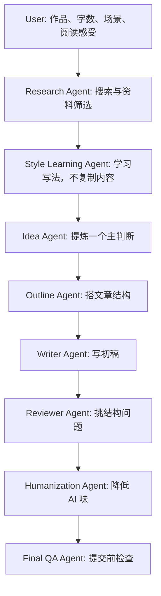

# Classic Literary Review Skill

一个面向中文读后感和文学长评的写作 Skill。

它不追求“一句话生成一篇文章”。它把读后感写作拆成研究、风格学习、主判断、结构、初稿、审稿、改稿和提交前检查，让文章尽量保留真实阅读痕迹。

## Table of Contents

- [项目特色](#项目特色)
- [快速开始](#快速开始)
- [安装](#安装)
- [如何使用](#如何使用)
- [最佳实践](#最佳实践)
- [项目结构](#项目结构)
- [工作流程](#工作流程)
- [Examples](#examples)
- [Roadmap](#roadmap)
- [Contributing](#contributing)
- [License](#license)
- [Contact](#contact)

## 项目特色

| 能做什么 | 不做什么 |
|---|---|
| 从真实阅读感受中提炼主判断 | 代写没有阅读痕迹的万能作文 |
| 联网整理高质量评论与常见角度 | 复制、拼接或改写外部评论 |
| 学习文章结构、节奏和转场方法 | 模仿单一作者的句子 |
| 搭结构、写初稿、审稿、改稿 | 用剧情复述填满篇幅 |
| 检查 AI 腔、套话和万能结尾 | 伪造用户没有经历过的阅读感受 |

## 快速开始

不要只输入：

```text
帮我写《活着》读后感。
```

更好的输入是：

```text
我读完《活着》后最难受的是福贵最后只剩下老牛作伴。
请围绕“苦难不是把人变伟大，而是把人一点点磨空”这个角度，
帮我写一篇 1000 字课堂读后感。
要求不要写成励志文，不要使用 AI 腔词。
请先确认结构，再写初稿。
```

如果还没有思路，可以先让 Skill 做角度整理：

```text
我刚读完《生死疲劳》，现在只有一些零散感受：
轮回、土地、苦难、荒诞、历史压迫感。
请先不要直接写文章，先帮我整理这些感受，提炼 3 个可写主判断。
```

## 安装

这个仓库是 Markdown-first 的 Skill Repository，不依赖构建步骤。

```bash
git clone https://github.com/lyingdowndragon6839-design/Classic-Literary-Review-Skill.git
cd Classic-Literary-Review-Skill
```

如果你的工具链要求固定入口文件，请把 [skill.md](skill.md) 作为 Skill 说明入口读取。不同宿主对文件名大小写的要求可能不同；本仓库按 GitHub 文档规范统一使用小写项目文件名。

## 如何使用

推荐按阶段推进：

| 阶段 | 让 Agent 做什么 | 产物 |
|---:|---|---|
| 1 | 明确作品、字数、场景和已有感受 | Task Brief |
| 2 | 搜索高质量评论，整理常见角度 | Research Summary |
| 3 | 学习开头、转场、结尾和节奏 | Style Bank |
| 4 | 提炼一个能成文的主判断 | Main Judgment |
| 5 | 搭结构，控制剧情比例 | Outline |
| 6 | 写初稿，保留用户声音 | Draft |
| 7 | 审稿、改稿、降低 AI 味 | Revision Report |
| 8 | 做提交前检查 | Final Essay |

更多场景见 [usage.md](usage.md)。

## 最佳实践

- 先给出真实阅读感受，再要求成稿。
- 先定主判断，再写段落。
- 剧情只作为证据，不作为主体。
- 联网时先研究，不从记忆直接写。
- 离线时明确说明限制，不伪造检索结论。
- 修改草稿时保留用户原意，不把文章改成陌生范文。

## 项目结构

```text
.
├── README.md
├── LICENSE
├── CHANGELOG.md
├── CONTRIBUTING.md
├── skill.md
├── workflow.md
├── usage.md
├── quality-check.md
├── search.md
├── style-learning.md
├── revision.md
├── reviewer.md
├── modules/
├── examples/
├── docs/
└── assets/
```

| 路径 | 用途 |
|---|---|
| [skill.md](skill.md) | Skill 入口、加载顺序和不可违反的规则 |
| [workflow.md](workflow.md) | 端到端工作流和 Agent 协作方式 |
| [usage.md](usage.md) | 面向普通用户的使用指南 |
| [quality-check.md](quality-check.md) | 写作质量与仓库质量检查清单 |
| [modules/](modules/) | 研究、结构、写作、改稿、审稿等内部模块 |
| [examples/](examples/) | 按作品拆分的示例文件 |
| [docs/](docs/) | 维护、离线模式、输出契约和路线图 |
| [assets/templates/](assets/templates/) | 可复制的工作模板 |

## 工作流程



完整流程见 [workflow.md](workflow.md)。

## Examples

| 作品 | 示例 |
|---|---|
| 《悲惨世界》 | [les-miserables.md](examples/les-miserables.md) |
| 《活着》 | [to-live.md](examples/to-live.md) |
| 《生死疲劳》 | [life-and-death-are-wearing-me-out.md](examples/life-and-death-are-wearing-me-out.md) |
| 《百年孤独》 | [one-hundred-years-of-solitude.md](examples/one-hundred-years-of-solitude.md) |
| 《平凡的世界》 | [ordinary-world.md](examples/ordinary-world.md) |
| 《罪与罚》 | [crime-and-punishment.md](examples/crime-and-punishment.md) |

全部示例见 [examples/README.md](examples/README.md)。

## Roadmap

当前版本已经完成核心工作流、模块拆分、示例整理和仓库工程化。后续维护计划见 [docs/roadmap.md](docs/roadmap.md)。

## Contributing

欢迎提交 Issue 或 Pull Request。新增内容请保持克制：优先修正流程、补充真实案例、改善文档链接和检查清单。贡献说明见 [CONTRIBUTING.md](CONTRIBUTING.md)。

## License

本项目使用 MIT License，见 [LICENSE](LICENSE)。

## Contact

请通过 [GitHub Issues](https://github.com/lyingdowndragon6839-design/Classic-Literary-Review-Skill/issues) 反馈问题、提出案例需求或讨论维护方向。
