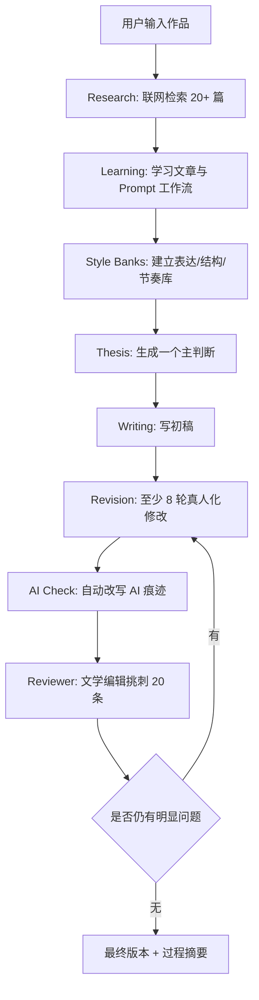

# Classic Literary Review Agent

一个面向中文名著读后感与文学长评的 Agentic Writing Skill。

它不是提示词合集，也不是“把文章写得不像 AI”的修辞补丁。它把一次写作拆成五个可检查阶段：

> Research -> Learning -> Writing -> Revision -> Review

用户输入一本名著后，Agent 必须先联网检索，阅读优秀评论，学习写法和结构，建立当次风格库，再形成自己的主判断，最后经过多轮改写和文学编辑式审稿，输出一篇原创读后感或文学长评。

## 设计理念

| 原则 | 含义 | 反面做法 |
|---|---|---|
| 先研究，再写作 | 写作前必须联网检索并形成 Research Summary | 直接凭印象生成读后感 |
| 学习写法，不复制内容 | 学行文节奏、段落组织、转场技巧、观点推进 | 摘抄、拼接、改写他人句子 |
| 一个中心观点 | 文章围绕最刺痛、最矛盾、最容易被忽略的问题展开 | 主题、人物、情节、意义并列罗列 |
| 多轮修改 | 至少八轮真人化修改，再进入 Reviewer 审稿 | 一稿输出后只做润色 |
| 自动去 AI 痕迹 | 检测到套话、空洞评价、节奏机械时直接改写 | 只提示用户“这里像 AI” |

## 工作流程



## 目录说明

| 路径 | 作用 |
|---|---|
| [SKILL.md](SKILL.md) | Codex Skill 入口，规定何时触发、必须加载哪些模块 |
| [SYSTEM.md](SYSTEM.md) | Agent 身份、硬性规则、输出契约 |
| [WORKFLOW.md](WORKFLOW.md) | 五阶段总流程与门禁 |
| [SEARCH.md](SEARCH.md) | 联网检索策略、来源优先级、Research Summary 格式 |
| [GITHUB_PROMPT_LEARNING.md](GITHUB_PROMPT_LEARNING.md) | GitHub Prompt 学习协议 |
| [STYLE_LEARNING.md](STYLE_LEARNING.md) | 从优秀文章中建立各类 Bank |
| [WRITING.md](WRITING.md) | 主判断生成与原创写作规则 |
| [REVISION.md](REVISION.md) | 改稿流程与版本管理 |
| [HUMANIZATION.md](HUMANIZATION.md) | 八轮真人化修改系统 |
| [AI_CHECK.md](AI_CHECK.md) | AI 痕迹检测与自动改写规则 |
| [REVIEWER.md](REVIEWER.md) | 文学杂志编辑式 Reviewer Agent |
| [QUALITY_CHECK.md](QUALITY_CHECK.md) | 最终自检清单 |
| [examples/](examples/) | 作品级完整样例 |
| [docs/](docs/) | 输出契约、联网伦理、离线模式、维护指南 |
| [assets/](assets/) | 可复用模板 |

## 如何使用

### 最小输入

```text
用 Classic Literary Review Agent 写《悲惨世界》读后感，2000 字，中文长文平台风格。
```

### 推荐输入

```text
作品：《百年孤独》
篇幅：2500-3000 字
读者：高中到大学阶段的普通读者
要求：不要剧情复述，重点写“孤独为什么是循环而不是性格”
必须联网：是
输出：Research Summary、Style Banks 摘要、初稿、修改记录、最终稿
```

### Agent 必须输出

1. Research Summary
2. Prompt Design Summary
3. Style Learning Summary
4. Main Thesis
5. Draft
6. Revision Log
7. AI Check Report
8. Reviewer Report
9. Final Essay

## 联网模式

> [!IMPORTANT]
> 只要运行环境支持联网，Agent 必须先联网，再写作。

联网模式下，Agent 至少阅读 20 篇相关材料，并优先检索知乎高赞回答、豆瓣长评、微信公众号文学评论、B 站读书 UP 主文字稿、中国知网公开摘要、文学网站评论、国外 Literary Review、Medium、Reddit Books、GitHub Prompt Repository。

## 离线模式

离线模式只能在用户明确允许时启用。Agent 必须说明：

- 当前无法联网。
- 输出基于模型已有知识和用户提供材料。
- 不能声称已经检索或阅读外部文章。
- 必须降低结论确定性。

详见 [docs/offline_mode.md](docs/offline_mode.md)。

## 适用模型

| 能力 | 建议 |
|---|---|
| 联网检索 | 必须支持搜索、打开网页、记录来源 |
| 长上下文 | 建议支持长文档阅读与跨文档综合 |
| 多轮写作 | 必须能保留草稿、修改记录和 Reviewer 意见 |
| 中文风格控制 | 必须能识别 AI 套话、作文腔、教材式分析 |

## Roadmap

- [x] v2.0: Agentic 五阶段重构
- [x] 联网检索协议
- [x] GitHub Prompt 学习模块
- [x] Style Banks 系统
- [x] Humanization 八轮改稿
- [x] Reviewer Agent
- [ ] v2.1: 加入可执行脚本，辅助生成 Research Summary 模板
- [ ] v2.2: 加入示例评测集与评分表
- [ ] v3.0: 支持本地资料库、浏览器自动化与引用管理

## 贡献指南

欢迎提交：

- 新作品 example。
- 更严格的 AI 痕迹规则。
- 更好的 Research Summary 模板。
- 真实写作案例的 Revision Log。
- 对搜索来源优先级的改进。

贡献时请遵守 [docs/research_ethics.md](docs/research_ethics.md)：不得复制外部文章，不得用改写掩盖抄袭，不得伪造联网研究。

