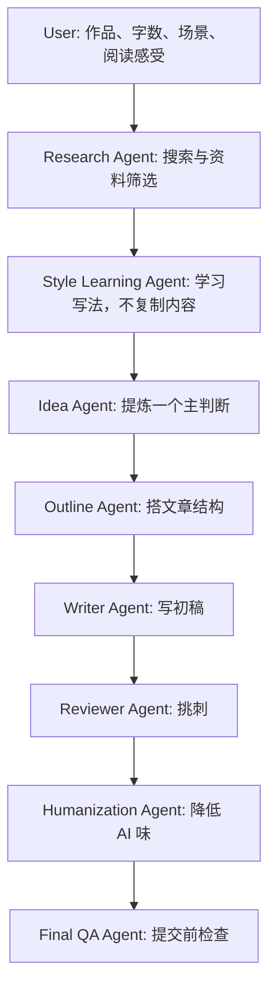

# Classic Literary Review Skill

一个面向中文读后感和文学长评的 Agentic Writing Skill。

它解决的不是“帮我随便生成一篇读后感”，而是一个更具体的问题：

> 我读完一本名著，有一些真实感受，但不知道怎么把它写成一篇不空、不俗、不像 AI 的文章。

好的读后感往往不是因为观点多，而是因为它抓住了一个真正刺人的判断，并且能用人物、情节、细节和阅读过程把这个判断慢慢写清楚。本仓库把这个过程拆成可以执行的研究、学习、构思、写作、修改和审稿流程。

## What This Skill Does

| 它适合做什么 | 它不适合做什么 |
|---|---|
| 联网查找高质量读后感和文学评论 | 一键代写一篇没有阅读痕迹的文章 |
| 从用户的零散感受里提炼主判断 | 用剧情复述填满篇幅 |
| 避开“苦难、人性、意义”这类空泛角度 | 把文章写成教材式主题分析 |
| 搭结构、写初稿、改草稿 | 把外部评论拼接成文章 |
| 检查 AI 腔和万能结尾 | 伪造用户没有经历过的阅读感受 |

## How It Works



每一步都有输入和输出。这样做慢一点，但更像真正写文章：先看别人怎么写，再判断自己要写什么，最后反复改。

## Best Practice

最推荐一步一步问，不推荐一句话生成全文。

| 步骤 | 你可以这样问 | 为什么有效 |
|---:|---|---|
| 1 | 先帮我搜索《悲惨世界》的高质量读后感和评论。 | 先知道别人已经写过什么，避免重复和俗套。 |
| 2 | 根据资料给我 5 个可写主判断。 | 先选观点，而不是直接凑段落。 |
| 3 | 选一个最适合 1500 字读后感的角度。 | 控制文章中心，防止观点散掉。 |
| 4 | 围绕这个角度搭结构。 | 让剧情只服务于论证。 |
| 5 | 按结构写初稿。 | 初稿有方向，不会变成资料堆。 |
| 6 | 帮我降低 AI 味。 | 删除套话，补阅读过程和句子节奏。 |
| 7 | 最后按提交场景润色。 | 课堂、知乎、豆瓣的表达边界不同。 |

完整提示词示例见 [PROMPTS.md](PROMPTS.md) 和 [USAGE.md](USAGE.md)。

## Quick Start

不要这样问：

```text
帮我写《活着》读后感。
```

这个输入太少，模型很容易写成“苦难使人坚强”“生命意义”之类模板文。

更好的问法：

```text
我读完《活着》后最难受的是福贵最后只剩下老牛作伴。请围绕“苦难不是把人变伟大，而是把人一点点磨空”这个角度，帮我写一篇 1000 字读后感。要求不要写成励志文，不要使用 AI 腔词。请先帮我确认结构，再写初稿。
```

如果你还没有思路：

```text
我刚读完《生死疲劳》，现在只有一些零散感受：轮回、土地、苦难、荒诞、历史压迫感。请先不要直接写文章，先帮我整理这些感受，提炼 3 个可写主判断。
```

如果你已经有草稿：

```text
下面是我的读后感草稿。请不要重写成另一篇文章，而是在尽量保留我原意的基础上，删掉 AI 腔、套话和空泛总结，让它更像一个大学生认真读完书后的自然表达。
```

## Recommended Input Template

```text
作品名称：
读完程度：
字数要求：
提交场景：
希望风格：
已有感受：
必须提到的人物/情节：
不想写的角度：
是否允许联网搜索：
是否需要降低 AI 味：
```

输入越具体，文章越不容易变成模板。尤其是“已有感受”和“不想写的角度”，它们能保住你的声音。

## Repository Map

| File | Purpose |
|---|---|
| [SKILL.md](SKILL.md) | Codex Skill 入口和加载顺序 |
| [SYSTEM.md](SYSTEM.md) | Agent 身份、边界和输出契约 |
| [WORKFLOW.md](WORKFLOW.md) | 端到端写作流程、每步输入输出、Agent 协作 |
| [DECISION_TREE.md](DECISION_TREE.md) | 不同用户场景的处理路径 |
| [PROMPTS.md](PROMPTS.md) | 可直接使用的 Prompt Library |
| [SEARCH.md](SEARCH.md) | 联网研究方法和 Research Summary 模板 |
| [STYLE_LEARNING.md](STYLE_LEARNING.md) | 风格学习和 Style Bank 模板 |
| [WRITING.md](WRITING.md) | 主判断、结构和初稿写法 |
| [REVISION.md](REVISION.md) | 修改流程和版本记录 |
| [HUMANIZATION.md](HUMANIZATION.md) | 降低 AI 味的八轮改稿 |
| [AI_CHECK.md](AI_CHECK.md) | AI 腔、逻辑跳跃和空洞结尾检查 |
| [REVIEWER.md](REVIEWER.md) | 文学编辑式审稿 |
| [QUALITY_CHECK.md](QUALITY_CHECK.md) | 提交前检查 |
| [USAGE.md](USAGE.md) | 普通用户使用指南 |
| [ROADMAP.md](ROADMAP.md) | 项目路线图 |
| [examples/](examples/) | 作品案例和完整写作流程 |
| [docs/](docs/) | 维护、离线模式、研究伦理、输出契约 |
| [assets/templates/](assets/templates/) | 可复制模板 |

## Online And Offline Mode

联网可用时，先搜索，再写作。搜索不是为了搬运观点，而是为了知道哪些角度已经被写烂，哪些细节值得重新看。

离线模式只适合两种情况：

- 用户明确不允许联网。
- 用户提供了足够的原文笔记或草稿。

离线时不能声称“检索发现”，也不能伪造外部评论。

## Examples

完整流程示例：

- [《悲惨世界》完整流程](examples/full_workflows/les_miserables.md)
- [《生死疲劳》完整流程](examples/full_workflows/life_and_death_are_wearing_me_out.md)
- [《百年孤独》完整流程](examples/full_workflows/one_hundred_years_of_solitude.md)
- [《活着》完整流程](examples/full_workflows/to_live.md)
- [《罪与罚》完整流程](examples/full_workflows/crime_and_punishment.md)

更多短案例在 [examples/](examples/)。

## Project Status

这个项目目前是 Markdown-first 的 Agent Workflow Repository。它已经包含研究流程、风格学习、读后感写作、审稿和 AI 痕迹检查。未来会继续向可执行脚本、MCP 支持和多 Agent 自动化推进。

详见 [ROADMAP.md](ROADMAP.md)。
