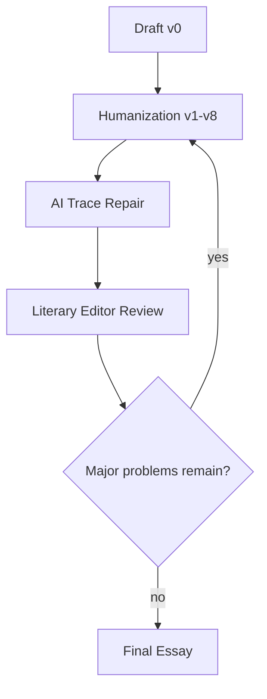

# Revision Module

## Revision Philosophy

Revision is not polish. Revision is where the article becomes written by a person rather than assembled by a model.

## Version Flow

## Revision Log

Every full run must produce:

| Version | Main Operation | What Changed | Remaining Risk |
|---|---|---|---|
| v0 | Draft |  |  |
| v1 | Delete templates |  |  |
| v2 | Sentence variation |  |  |
| v3 | Paragraph rhythm |  |  |
| v4 | Detail reinforcement |  |  |
| v5 | Reader psychology |  |  |
| v6 | Observation over explanation |  |  |
| v7 | Rhythm and silence |  |  |
| v8 | Editor-level rewrite |  |  |

## Structural Revision Questions

- Does the opening create a problem?
- Does every paragraph move the thesis?
- Is any paragraph merely admiring the book?
- Does the article return to the same detail with deeper meaning?
- Is plot summary below 20 percent?
- Are the best sentences serving the thesis, or showing off?

## When To Restart

Restart from thesis if:

- the article has more than one center;
- the best evidence does not support the thesis;
- the piece reads like a list of insights;
- the ending depends on generic life advice;
- Reviewer finds the same problem twice.

