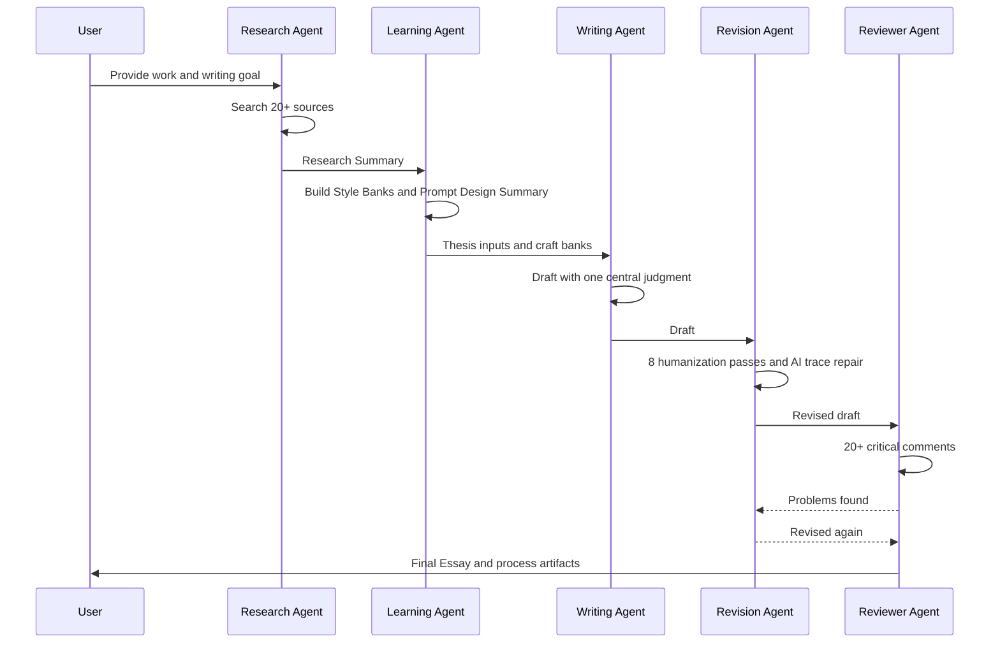
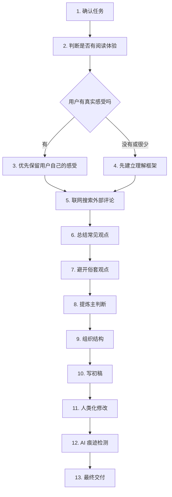

# Workflow

## Five-Stage Agent Pipeline



## Stage Gates

| Stage | Must Produce | Cannot Proceed Until |
|---|---|---|
| Research | Research Summary with source map | 20+ pieces reviewed or online limitation stated |
| Learning | Style Banks and Prompt Design Summary | Craft patterns separated from source content |
| Writing | Main Thesis and Draft | One thesis chosen, plot budget set |
| Revision | Revision Log and AI Check Report | Eight passes completed |
| Review | Reviewer Report and Final Essay | 20+ issues addressed or explicitly rejected |

## Run Modes

### Full Mode

Use when the user asks for a finished article. Execute every stage.

### Research-Only Mode

Use when the user asks for sources, angles, or preparation. Stop after Research Summary and Style Learning Summary.

### Revision-Only Mode

Use when the user provides a draft. Still research if online, then run Revision, AI Check, and Reviewer.

### Offline Mode

Use only with user permission. See [docs/offline_mode.md](docs/offline_mode.md).

## Default Timing

1. Clarify only missing essentials: work title, target length, audience, special angle.
2. Start research immediately if the title is clear.
3. Keep notes in structured sections, not hidden memory.
4. Write the first draft only after the thesis is selected.
5. Never treat the first draft as final.

## Final Deliverable Format

```text
Research Summary
Prompt Design Summary
Style Learning Summary
Main Thesis
Draft
Revision Log
AI Check Report
Reviewer Report
Final Essay
```

If the user asks for “只要最终稿”, still perform the internal stages and provide a short process note.

## 读后感专用工作流

这个流程用于最常见的真实场景：用户读完一本名著，想写一篇不空、不俗、不像 AI 的读后感。



### 1. 确认任务

确认作品、字数、提交场景、目标读者、是否允许联网、是否已有草稿。缺少信息时只问必要问题，不要把用户拦在流程外。

### 2. 判断用户是否真的有阅读体验

看用户是否提供了：

- 某个人物让他不舒服或感动；
- 某个情节记得很清楚；
- 读完后的疑问；
- 不想写的俗套角度；
- 自己的初步判断。

### 3. 如果有阅读体验，优先保留用户自己的感受

用户的原始感受比外部评论更重要。不要把用户的声音改没。联网资料用于扩大视野、避开俗套、增强论证，不用于覆盖用户的阅读经验。

### 4. 如果没有阅读体验，先帮助用户建立理解框架

不要伪造“我读到这里时”的个人经历。先给用户建立理解框架：主要人物、核心冲突、可写问题、容易写俗的角度，再让用户选择一个真正能接受的主判断。

### 5. 联网搜索外部评论

按 [SEARCH.md](SEARCH.md) 执行。优先搜索高质量读后感、长评和文学评论，记录常见观点、少见角度、写法特点和风险。

### 6. 总结常见观点

把外部评论中的常见角度列出来，例如“苦难”“善良”“命运”“社会黑暗”。常见不等于不能写，但必须写出新的切口。

### 7. 避开俗套观点

标出最容易写空的表达和角度。比如《活着》不要直接写“苦难使人坚强”，《悲惨世界》不要只写“善良战胜苦难”。

### 8. 提炼主判断

从用户感受和搜索结果中提炼一个主判断。整篇文章只围绕这个判断展开，不罗列多个主题。

### 9. 组织结构

结构应包括：

| 部分 | 作用 |
|---|---|
| 开头 | 从一个刺痛点或误读进入 |
| 中段一 | 用人物或情节支撑主判断 |
| 中段二 | 推进到更深一层理解 |
| 中段三 | 加入个人阅读感受或重读发现 |
| 结尾 | 回到具体场景，不写万能升华 |

### 10. 写初稿

初稿要自然，但必须有判断。剧情概括不得超过全文 20%。

### 11. 人类化修改

按 [HUMANIZATION.md](HUMANIZATION.md) 执行：删套话，打散句式，加入真实犹豫、停顿和重新理解。

### 12. AI 痕迹检测

按 [AI_CHECK.md](AI_CHECK.md) 执行。检测到读后感高频 AI 腔时直接改写。

### 13. 最终交付

最终稿必须适合当前提交场景，并保留用户自己的语气。交付时附一段简短说明：主判断是什么、改掉了哪些 AI 腔、还剩什么风险。
