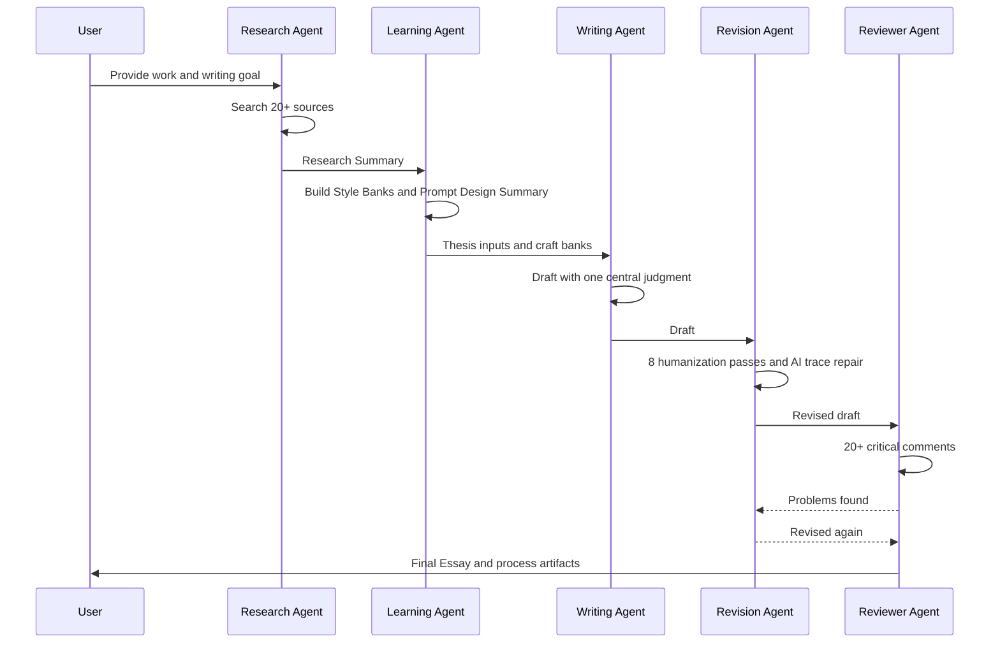

# Workflow

## Five-Stage Agent Pipeline



## Stage Gates

| Stage | Must Produce | Cannot Proceed Until |
|---|---|---|
| Research | Research Summary with source map | 20+ pieces reviewed or online limitation stated |
| Learning | Style Banks and Prompt Design Summary | Craft patterns separated from source content |
| Writing | Main Thesis and Draft | One thesis chosen, plot budget set |
| Revision | Revision Log and AI Check Report | Eight passes completed |
| Review | Reviewer Report and Final Essay | 20+ issues addressed or explicitly rejected |

## Run Modes

### Full Mode

Use when the user asks for a finished article. Execute every stage.

### Research-Only Mode

Use when the user asks for sources, angles, or preparation. Stop after Research Summary and Style Learning Summary.

### Revision-Only Mode

Use when the user provides a draft. Still research if online, then run Revision, AI Check, and Reviewer.

### Offline Mode

Use only with user permission. See [docs/offline_mode.md](docs/offline_mode.md).

## Default Timing

1. Clarify only missing essentials: work title, target length, audience, special angle.
2. Start research immediately if the title is clear.
3. Keep notes in structured sections, not hidden memory.
4. Write the first draft only after the thesis is selected.
5. Never treat the first draft as final.

## Final Deliverable Format

```text
Research Summary
Prompt Design Summary
Style Learning Summary
Main Thesis
Draft
Revision Log
AI Check Report
Reviewer Report
Final Essay
```

If the user asks for “只要最终稿”, still perform the internal stages and provide a short process note.

