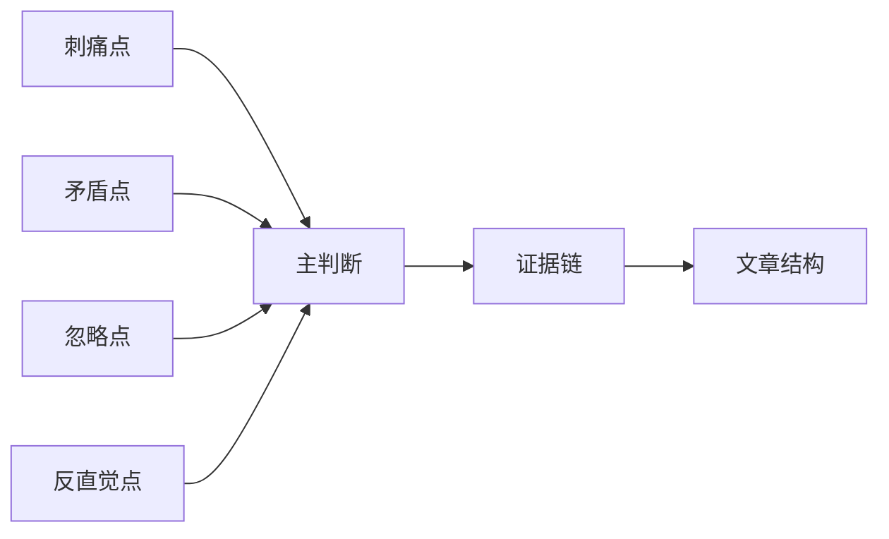

# Writing Module

## Core Thesis Rule

Do not write by template categories:

```text
主题 -> 人物 -> 情节 -> 意义
```

Instead, search for:

- the most painful point;
- the most contradictory point;
- the most overlooked point;
- the most counterintuitive point.

Then form one main thesis.

## Thesis Builder



## Good Thesis Tests

| Test | Pass Condition |
|---|---|
| Specificity | It cannot be moved unchanged to another book |
| Tension | It contains a conflict, reversal, or discomfort |
| Evidence | At least three textual details can support it |
| Scope | It can sustain the target length |
| Originality | It is not merely the most common search result |

## Plot Budget

Plot summary must stay under 20 percent of the final essay.

Use plot only to:

- introduce evidence;
- clarify a contradiction;
- explain why a detail matters;
- return the reader to a scene.

Do not narrate the book in order.

## Article Architecture

| Section | Function | Forbidden |
|---|---|---|
| Opening | Establish a new angle | Biography, fame, summary |
| First turn | Correct a common misreading | “大家都知道” |
| Evidence body | Build the thesis through details | Example stacking |
| Deepening | Move from person to structure or rereading | Abstract slogan |
| Ending | Return to human recognition | Generic inspiration |

## Drafting Instructions

1. State the main thesis before drafting.
2. Choose three to five evidence nodes.
3. Assign one function to each paragraph.
4. Vary paragraph length.
5. Keep one or two moments of reader psychology:
   - “我第一次读到这里时……”
   - “后来重读，我才意识到……”
   - “直到结尾，我才明白……”
6. Avoid namedropping unless it changes the reading.

## Originality Guard

Before finalizing the thesis, compare it with the Research Summary:

- If it repeats the dominant online angle, add a sharper distinction.
- If it depends on a single source, rebuild it from textual details.
- If it sounds impressive but cannot be evidenced, discard it.

