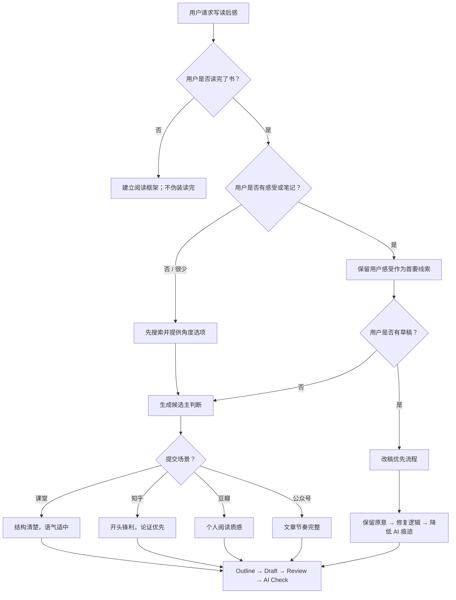

# Decision Tree

当用户请求不清楚、不完整，或不是标准的"写一篇完整读后感"时，使用这个文件。

## 主路由



## 常见情况

### 用户没有读完书

应该做的：

- 建立人物和冲突地图
- 列出阅读时要注意的问题
- 建议读完后的可能角度

不应该做的：

- 写"读完整本书后我觉得"
- 编造个人阅读感受

### 用户只有一个感受

一个感受就够了。把它当成种子。

```text
我最难受的是福贵最后只剩老牛。
```

转换成：

```text
主判断：《活着》不是把苦难写成伟大，而是写人被磨空以后仍然还在活着。
```

### 用户已有草稿

从编辑开始，不从重写开始。

| 步骤 | 动作 |
|---|---|
| 1 | 识别用户的主要意图 |
| 2 | 标记 AI 套话和空泛主张 |
| 3 | 修复逻辑和证据 |
| 4 | 保留声音 |
| 5 | 产出修改版 |

### 用户只想降 AI 味

不只是换词。要看的包括：

- 句子节奏
- 段落形状
- 剧情到判断的连接
- 泛化结尾
- 缺失的阅读过程

### 课堂提交

保持清楚即可，不要过度风格化。

好的课堂读后感通常有：

- 一个主判断
- 几个具体细节
- 适度的个人声音
- 没有网络用语
- 没有空洞道德结尾
