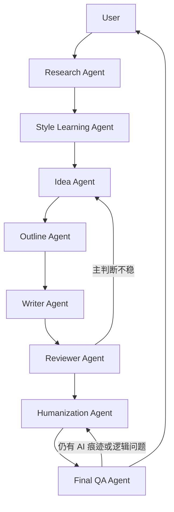
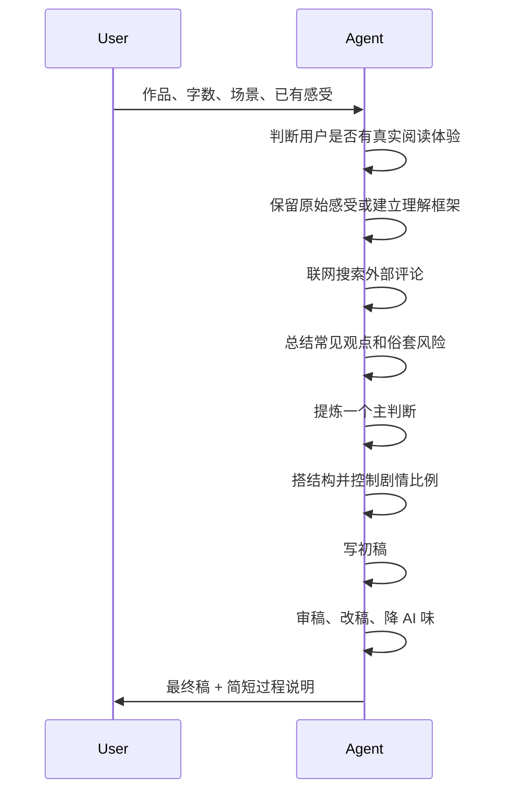

# Workflow

读后感写作不从"成稿"开始，而是从一串可检查的小决定开始：读到了什么、
要抓住哪个判断、哪些情节能支撑它、哪些表达需要删掉。

## Agent 协作



| Agent | 职责 | 输入 | 输出 | 什么时候重跑 |
|---|---|---|---|---|
| Research Agent | 搜索并筛选外部资料 | 作品、目标、联网许可 | Research Summary | 来源太少、重复、打不开 |
| Style Learning Agent | 学写法，不学句子 | Research Summary | Style Bank | 初稿像模板文 |
| Idea Agent | 选一个主判断 | 用户感受、资料摘要 | Main Judgment | 判断太大或太常见 |
| Outline Agent | 把判断拆成结构 | 主判断、证据 | Outline | 剧情复述过多 |
| Writer Agent | 写初稿 | Outline、Style Bank | Draft | 初稿没有用户声音 |
| Reviewer Agent | 挑结构和文学问题 | Draft | Reviewer Notes | 问题属于主判断层面 |
| Humanization Agent | 改节奏、细节和 AI 味 | Draft、Reviewer Notes | Revised Draft | 文字仍像生成 |
| Final QA Agent | 提交前检查 | Revised Draft | Final Essay | 逻辑断裂或场景不匹配 |

## 分步契约

| 步骤 | 输入 | 处理 | 输出 |
|---:|---|---|---|
| 1 | 作品、字数、场景 | 确认任务和缺失信息 | Task Brief |
| 2 | 用户笔记或感受 | 判断是否有真实阅读体验 | Reading Clues |
| 3 | 联网许可 | 搜索高质量读后感和评论 | Source List |
| 4 | Source List | 提取常见观点和少见角度 | Research Summary |
| 5 | Research Summary | 学开头、转场、结尾和节奏 | Style Bank |
| 6 | Reading Clues + Research Summary | 生成候选主判断 | Judgment List |
| 7 | Judgment List | 选择一个有证据的主判断 | Main Judgment |
| 8 | Main Judgment | 搭文章结构 | Outline |
| 9 | Outline | 写初稿，剧情不超过 20% | Draft |
| 10 | Draft | 检查逻辑、空话和节奏 | Reviewer Notes |
| 11 | Reviewer Notes | 改声音、细节和结构 | Revised Draft |
| 12 | Revised Draft | 检查 AI 痕迹和逻辑跳跃 | Revision Report |
| 13 | Revision Report | 按提交场景润色 | Final Essay |

## 专用流程



## 常见分支

### 用户有真实阅读体验

优先保留。"我读到老牛那里很难受"比"生命意义"这种大词更有价值。
外部评论可以帮助深化这句话，但不能盖住它。

### 用户没有读完书

不要伪装完整读后感。先做阅读框架：人物关系、主要冲突、后续阅读要注意的问题、
读完后可能写的角度。

### 用户已有草稿

先做编辑，不要重写。保留原意和语气，标出问题，再修逻辑、证据、节奏和 AI 痕迹。

## 输出模板

```markdown
## Task Brief

## Research Summary

## Style Bank

## Main Judgment

## Outline

## Draft

## Reviewer Notes

## Revision Report

## Final Essay
```

更严格的交付格式见 [docs/output-contracts.md](docs/output-contracts.md)。
